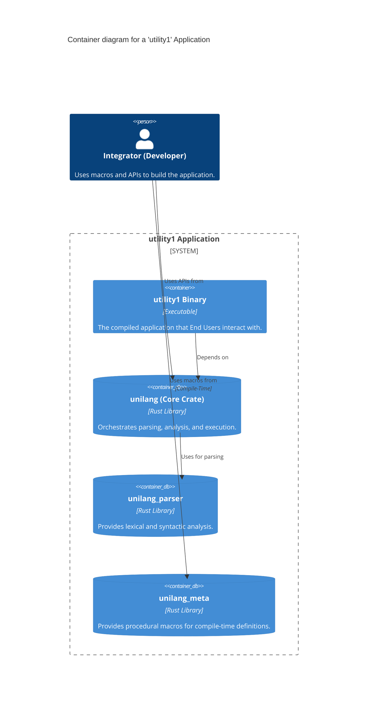
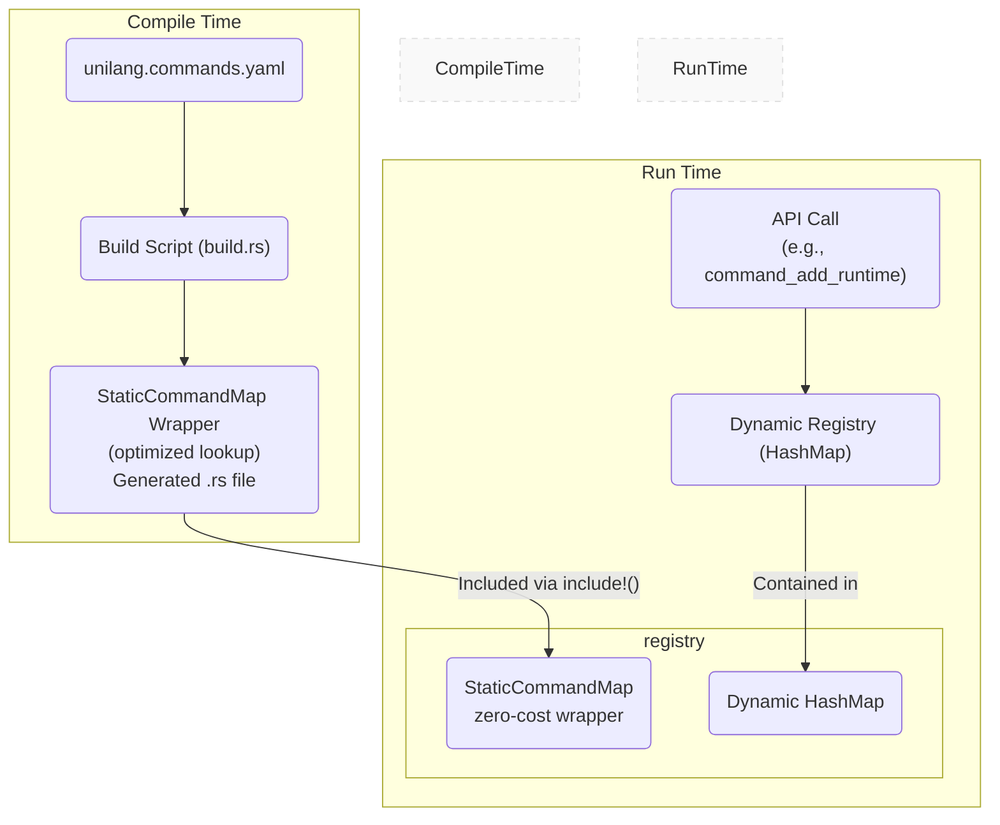
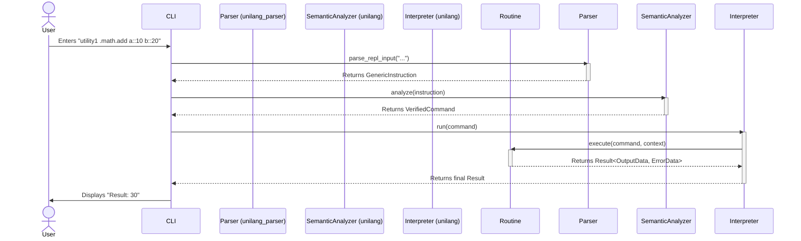

# Architecture: Mandates

### Scope

- **Purpose:** Define the architectural mandates, system diagrams, and crate responsibilities
- **Responsibility:** Governing architectural decisions that all contributors must follow
- **In Scope:** Architectural mandates, system diagrams, crate responsibility boundaries
- **Out of Scope:** Feature requirements, API contracts, implementation specifics

### Architectural Mandates & Design Principles

It is recommended that the `unilang` ecosystem adhere to the following principles:

- **Parser Independence:** The `unilang` core crate **should** delegate all command string parsing to the `unilang_parser` crate.
- **Zero-Overhead Static Registry:** To meet `NFR-PERF-1`, it is **strongly recommended** that the `CommandRegistry` be implemented using a hybrid model:
  - An **optimized static map**, generated at compile-time in `build.rs`, for all statically known commands. The implementation **must** be hidden behind the `StaticCommandMap` wrapper to prevent dependency leakage.
  - A standard `HashMap` for commands registered dynamically at runtime.
  - Lookups **should** check the static map first before falling back to the dynamic map.
  - Downstream crates **must not** require implementation-specific dependencies — the wrapper ensures complete encapsulation.
  - See `docs/architecture/004_implementation_details.md` for the compile-time optimization strategy.
- **`enabled` Feature Gate Mandate:** All framework crates **must** implement the `enabled` feature gate pattern. The entire crate's functionality, including its modules and dependencies, **should** be conditionally compiled using `#[cfg(feature = "enabled")]`. This is a critical mechanism for managing complex feature sets and dependencies within a Cargo workspace, allowing a crate to be effectively disabled even when it is listed as a non-optional dependency.

### Architectural Diagrams

#### Use Case Diagram

```mermaid
graph TD
    subgraph Unilang Framework
        UC1(Define Command<br/>(Static or Dynamic))
        UC2(Implement Routine)
        UC3(Configure Framework)
        UC4(Execute Command)
        UC5(Request Help)
        UC6(List Commands)
    end

    actorIntegrator["Integrator<br/>(Developer)"]
    actorEndUser["End User"]

    actorIntegrator --> UC1
    actorIntegrator --> UC2
    actorIntegrator --> UC3

    actorEndUser --> UC4
    actorEndUser --> UC5
    actorEndUser --> UC6
```

#### System Context Diagram

```mermaid
graph TD
    style Integrator fill:#fff,stroke:#333,stroke-width:2px
    style EndUser fill:#fff,stroke:#333,stroke-width:2px

    Integrator(Integrator<br/>(Developer))
    EndUser(End User)

    subgraph "utility1 Application"
        Unilang["unilang Framework"]
        Utility1[utility1 Binary]
    end

    style Unilang fill:#1168bd,color:#fff
    style Utility1 fill:#22a6f2,color:#fff

    Integrator -- "Uses to build" --> Unilang
    Unilang -- "Is a dependency of" --> Utility1
    EndUser -- "Interacts with" --> Utility1
```

#### C4 Container Diagram



#### High-Level Architecture (Hybrid Registry)



#### Sequence Diagram: Unified Processing Pipeline



### Crate-Specific Responsibilities

- **`unilang` (Core Framework):** Recommended to be the central orchestrator, implementing the `CommandRegistry`, `SemanticAnalyzer`, `Interpreter`, `Pipeline`, and all core data structures.
- **`unilang_parser` (Parser):** Recommended to be the dedicated lexical and syntactic analyzer. It should be stateless and have no knowledge of command definitions.
- **`unilang_meta` (Macros):** Recommended to provide procedural macros for a simplified, compile-time developer experience.

### Type-Safe API Redesign

The `CommandDefinition` public type underwent a complete type-safe redesign (v3.1.0) implementing the "parse don't validate" principle. Invalid states are now impossible to represent at compile time.

The old API allowed commands to be constructed in invalid states that only failed at runtime during registration. The redesign moves all validation to construction time:

- **Private fields with getter methods:** All `CommandDefinition` fields are now private; access is via getter methods, preventing mutation after construction.
- **Validated newtypes:** `CommandName` guarantees dot prefix; `NamespaceType` guarantees valid namespace; `VersionType` guarantees non-empty version; `CommandStatus` is an enum (`Active`, `Deprecated`, `Experimental`, `Internal`) replacing the former string field.
- **Type-state builder:** `CommandDefinition::former()` uses phantom types to enforce required fields at compile time. The `end()` method requires only `name` and `description` with defaults. The `build()` method requires all fields explicitly.
- **Breaking changes:** Field access changed from direct (`cmd.name`) to getter methods (`cmd.name()`); invalid commands panic at construction, not registration.

This mandate is motivated by the "Make Illegal States Unrepresentable" governing principle in `invariant/003`.

### Architectures

| File | Relationship |
|------|--------------|
| [002_benchmark_separation.md](002_benchmark_separation.md) | Benchmark architecture mandate |
| [003_vision_scope.md](003_vision_scope.md) | Vision that these mandates implement |
| [004_implementation_details.md](004_implementation_details.md) | Compile-time optimization strategy |

### Invariants

| File | Relationship |
|------|--------------|
| [002_non_functional_requirements.md](../invariant/002_non_functional_requirements.md) | NFRs that mandates enforce |
| [003_governing_principles.md](../invariant/003_governing_principles.md) | Principles these mandates enforce |
| [004_workspace_dependency_standards.md](../invariant/004_workspace_dependency_standards.md) | `enabled` feature gate mandate source |

### Sources

| File | Relationship |
|------|--------------|
| `src/lib.rs` | Module structure reflecting mandate boundaries |
| `build/main.rs` | Build-time mandate enforcement |
